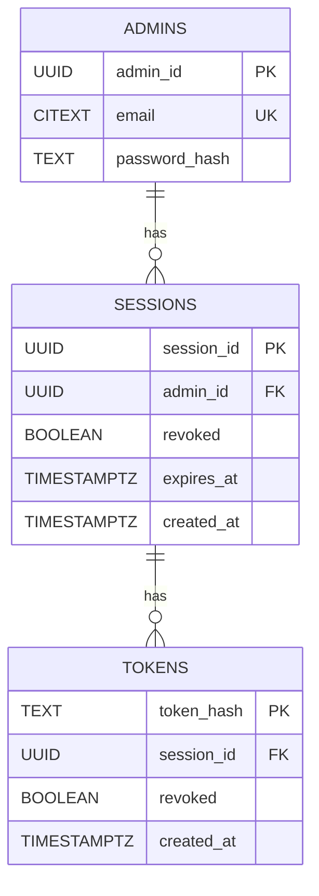
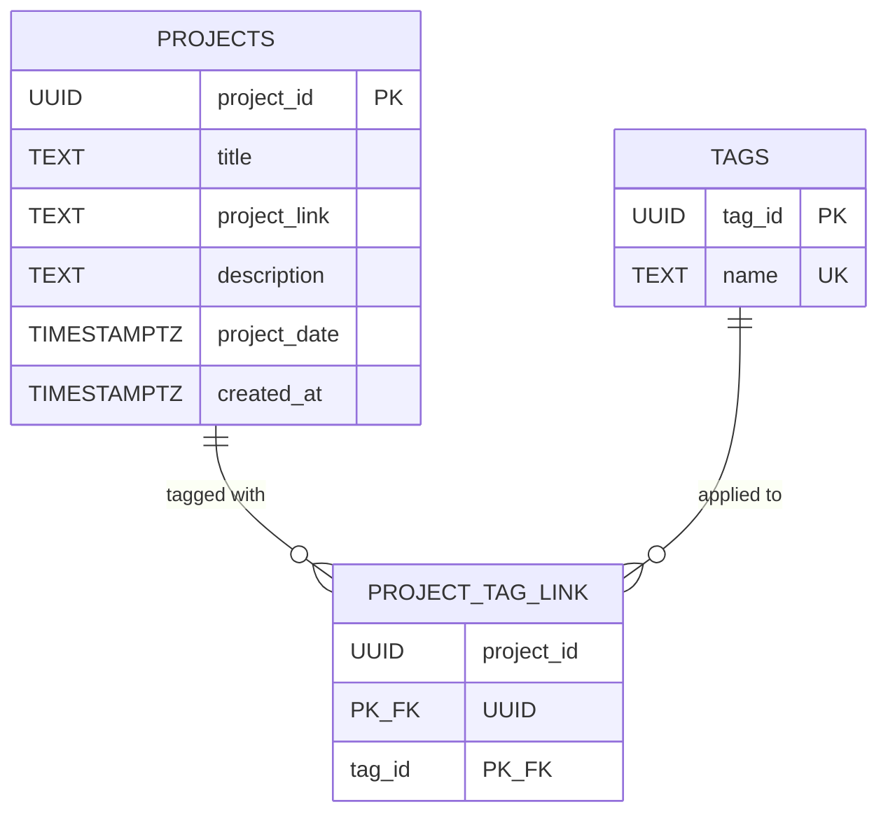
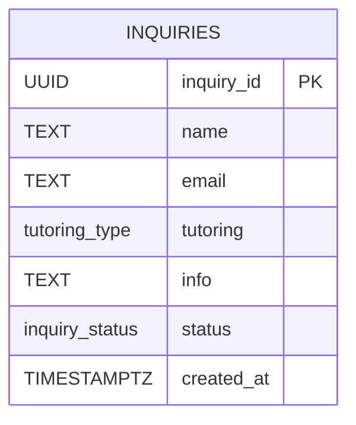

# Database Schema

This project uses three isolated PostgreSQL databases — `authdb`, `portfoliodb`, and `inquirydb` — each owned by its own admin role, with `PUBLIC` default privileges stripped. Isolation keeps a compromise or bug in one subsystem (e.g. the tutoring inquiry form) from having any DB-level reach into another (e.g. admin sessions).

Each live database has a matching test database, prefixed with `test`, used for local/CI testing against `.env.test`.

---

## `authdb`

Owning role: **`auth_admin`**

Backs the authentication system: admin accounts, their login sessions, and the refresh tokens issued within those sessions.

**`admins`** — one row per admin account. `email` is `citext`, so lookups and the uniqueness constraint are case-insensitive. `password_hash` stores a bcrypt hash, never the plaintext.

**`sessions`** — one row per login. `admin_id` cascades on delete, so removing an admin account cleans up its sessions automatically. `expires_at` defaults to 30 days out; `revoked` lets a session be killed early (e.g. on logout or suspected compromise) without waiting for expiry.

**`tokens`** — refresh tokens issued within a session, stored as hashes (`token_hash`) rather than raw values, so a DB read alone can't be used to forge a session. Cascades on `session_id` delete. Indexed on `session_id` to keep rotation/reuse-detection lookups ("all tokens for this session") fast, since foreign key columns aren't indexed automatically in Postgres.

---

## `portfoliodb`

Owning role: **`portfolio_admin`**

Backs the public portfolio: projects and the tags used to categorise them.

**`projects`** — one row per portfolio project. `project_date` is when the project itself is dated (e.g. when it was built or published); `created_at` is when the row was inserted — these will usually differ for backfilled projects.

**`tags`** — categorisation labels (e.g. "Haskell", "REST APIs"). `name` is unique, so the same tag can't be created twice under different IDs.

**`project_tag_link`** — many-to-many join between `projects` and `tags`, both sides cascading on delete. The composite primary key `(project_id, tag_id)` naturally indexes "all tags for a project"; a secondary index on `tag_id` alone covers the reverse lookup, "all projects with this tag" (used when filtering the portfolio by tag), which the PK doesn't serve efficiently on its own.

---

## `inquirydb`

Owning role: **`inquiry_admin`**

Backs the tutoring inquiry form. Deliberately the simplest and most isolated of the three: it only ever needs to accept and track inquiries, with no relationship to auth or portfolio data.

**`inquiries`** — one row per submitted inquiry. `tutoring` is a Postgres enum (`tutoring_type`: `GCSE`, `ALevel`, `Oxbridge`, `other`) constraining which tier was requested. `status` is a separate enum (`inquiry_status`: `sent`, `pending`, `failed`, `denied`) tracking where the inquiry is in its lifecycle; it has no default, so a freshly inserted row starts `NULL` until something sets it.

---

## Test databases

Each live database above has a corresponding test database, used for local development and CI. They share **exactly the same schema** as their live counterpart — same tables, columns, constraints, and indexes — with `test` prepended to both the database name and the owning role:

| Live DB        | Live role          | Test DB             | Test role               |
|-----------------|---------------------|-----------------------|----------------------------|
| `authdb`        | `auth_admin`        | `testauthdb`          | `testauth_admin`          |
| `portfoliodb`   | `portfolio_admin`   | `testportfoliodb`     | `testportfolio_admin`     |
| `inquirydb`     | `inquiry_admin`     | `testinquirydb`       | `testinquiry_admin`       |

### Seed data

`testauthdb` and `testportfoliodb` are seeded with fixed, deterministic rows so tests can assert against known values rather than data generated at runtime. `testinquirydb` currently has no seed data — it's created empty, schema only.

#### `testauthdb`

**`admins`**

| admin_id | email | password_hash |
|---|---|---|
| `123e4567-e89b-42d3-a456-426614174000` | `admin@example.com` | `$2y$14$riUZ1r4Gkl2GIn8Lln6mIuUSj7Re7gx2Wsb5sLraV757/TrQKfMiy` (bcrypt hash of `password`) |

**`sessions`**

| session_id | admin_id | revoked | expires_at | created_at |
|---|---|---|---|---|
| `123e4567-e89b-42d3-a456-426614174001` | `123e4567-e89b-42d3-a456-426614174000` | `False` | `2000-12-25T00:00:00+00:00` | `2000-11-26T00:00:00+00:00` |
| `123e4567-e89b-42d3-a456-426614174002` | `123e4567-e89b-42d3-a456-426614174000` | `True` | `now() + 30 days` | `now()` |

The first session is a long-expired but non-revoked session from 2000, useful for exercising expiry checks independently of revocation. The second is revoked but not expired session.

#### `testportfoliodb`

**`projects`**

| project_id | title | project_link | description | project_date | created_at |
|---|---|---|---|---|---|
| `123e4567-e89b-42d3-a456-426614174000` | Personal Website | `github.com/CharliePilkington216/Personal_Website` | This is the website you are currently on! | `2026-08-19T00:00:00+00:00` | `2026-08-19T00:00:00+00:00` |

**`tags`**

| tag_id | name |
|---|---|
| `123e4567-e89b-42d3-a456-426614174001` | Haskell |
| `123e4567-e89b-42d3-a456-426614174002` | REST APIs |
| `123e4567-e89b-42d3-a456-426614174003` | Postgresql |

**`project_tag_link`**

| project_id | tag_id |
|---|---|
| `123e4567-e89b-42d3-a456-426614174000` | `123e4567-e89b-42d3-a456-426614174001` |
| `123e4567-e89b-42d3-a456-426614174000` | `123e4567-e89b-42d3-a456-426614174002` |
| `123e4567-e89b-42d3-a456-426614174000` | `123e4567-e89b-42d3-a456-426614174003` |

The single seeded project is linked to all three seeded tags.

#### `testinquirydb`

Exists with the same schema as `inquirydb` (the `inquiry_status` and `tutoring_type` enums plus the `inquiries` table), owned by `testinquiry_admin`. No rows are seeded.
